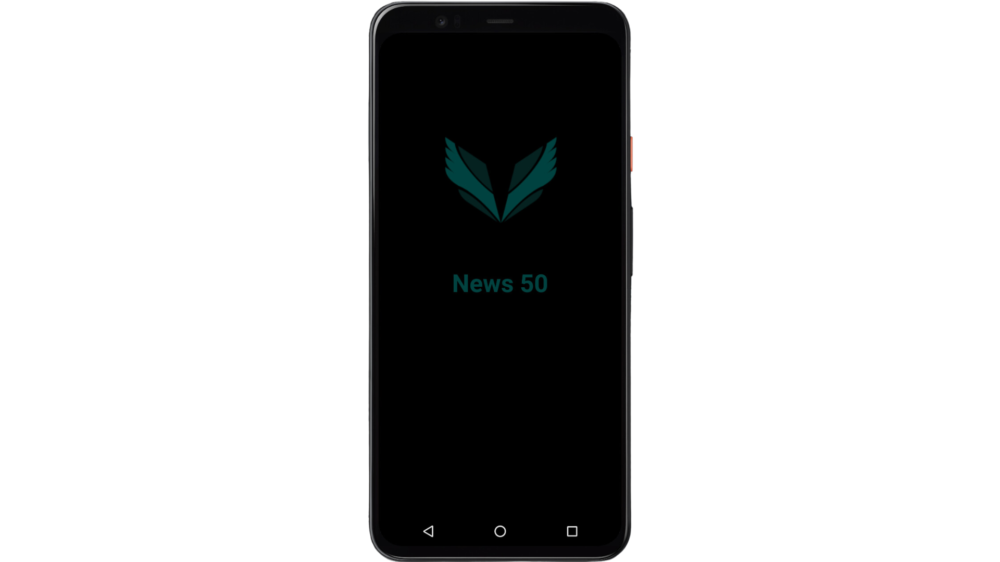

# News 50

<p float="left">
  
  
  
</p>


## Description

# 🌟 News50 Mobile Application 🌟

- 🛠️ **Built with Java**: Utilizes a variety of libraries such as Retrofit, Ion, OkHttp, Glide, RecyclerView, Dexter, Navigation Bar Library, and Fragment.
- 📰 **Powered by News API**: Fetches data from newsapi.org, offering a wide range of news sources.
- 📚 **Categories**: Access articles from various categories like sports, technology, and entertainment.
- 📂 **Structured Packages**: Includes adapter classes, interfaces, fragments, models, and utility classes for a seamless user experience.
- 🔄 **RecyclerView vs ListView**: Chose RecyclerView for better performance and customization.
- 🗂️ **Navigation Bar**: Easy navigation between different categories with a bottom-screen navigation bar.
- 📖 **Article Access**: Users can read full articles by clicking on curated news links.
- 🚀 **Performance & Reliability**: Ensures fast and responsive user experience, even on low-end devices.

## 💡 Key Features:
- Clean and user-friendly interface.
- Integration with News API for global news coverage.
- Efficient network communication and caching mechanisms.

### 🌐 Overall
News50 is an excellent app for staying informed with the latest global news, offering a fast, reliable, and intuitive news browsing experience. Whether you're deeply interested in current events or just want occasional updates, News50 caters to all news enthusiasts! 🌍📈📲


## Table of Contents

- [News 50](#news50)
  - [Description](#description)
  - [Table of Contents](#table-of-contents)
  - [Installation](#installation)
  - [Contact](#contact)

## Installation

To run this project locally, follow these steps:

1. Clone the repository:

```bash
 git clone https://github.com/septan4/News50.git
```


## Contact

Feel free to reach out to me via email at [sepehr75t@gmail.com](mailto:sepehr75tl@gmail.com) or on [LinkedIn](https://www.linkedin.com/in/sepehrtanhaei/).

[](https://github.com/septan4/neumorphisem-portfolio/stargazers)
[](https://github.com/septan4/neumorphisem-portfolio/network)
[](https://github.com/septan4/neumorphisem-portfolio/issues)
